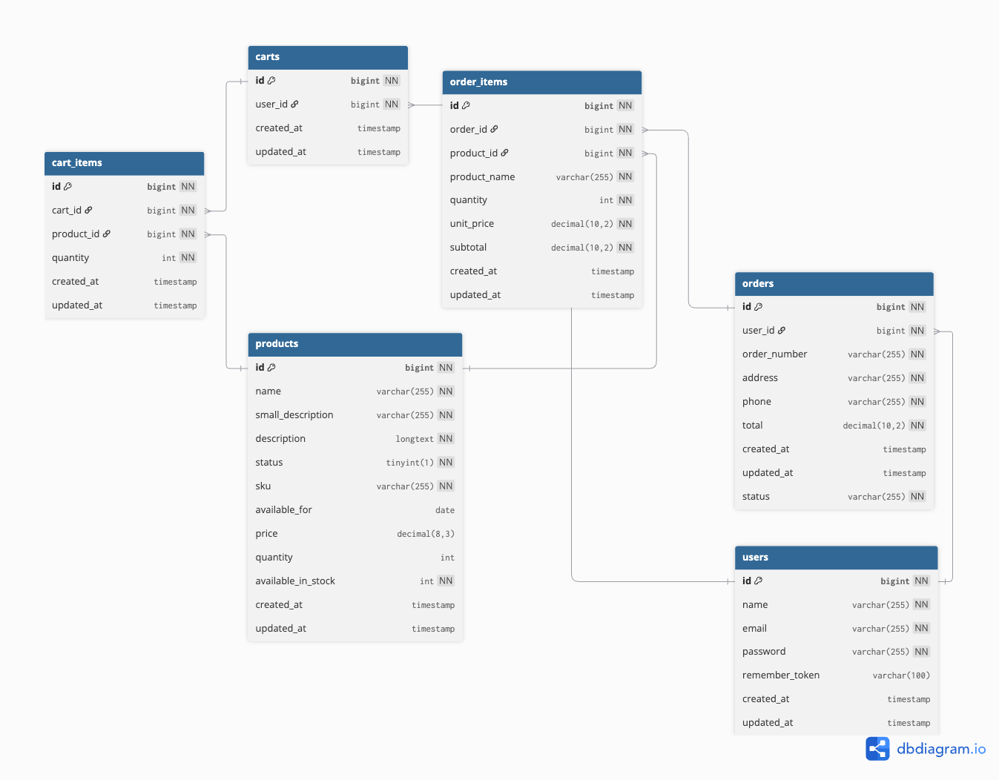

# E-Commerce API

A RESTful API for an e-commerce platform built with Laravel and JWT Authentication.

## Features

- 🔐 JWT Authentication (Register, Login, Logout)
- 📦 Products Management (CRUD operations)
- 🛒 Shopping Cart (Add, Update, Remove items)
- 📋 Orders Management (Create orders from cart)
- 📊 Stock Management (Auto-decrement on order)

## Requirements

- PHP >= 8.2
- Composer
- MySQL >= 8.0

## Installation

### 1. Clone the repository

```bash
git clone https://github.com/Freddiefady/E-commerce-Api.git
cd E-commerce-Api
```

### 2. Quick Setup

Run all setup steps at once:

```bash
composer setup
```

### 3. Configure Environment

Edit your `.env` file:

```env
DB_CONNECTION=mysql
DB_HOST=127.0.0.1
DB_PORT=3306
DB_DATABASE=e_commerce_api
DB_USERNAME=root
DB_PASSWORD=
```

## Running the Application

### Development Server

```bash
composer dev
```

Or manually:

```bash
php artisan serve
```

The API will be available at `http://localhost:8000`

## API Endpoints

### Base URL
```
http://localhost:8000/api
```

### Authentication
All protected routes require Bearer token:
```
Authorization: Bearer <your-jwt-token>
```

### Auth Endpoints

| Method | Endpoint | Description | Auth |
|--------|----------|-------------|------|
| POST | `/auth/register` | Register new user | No |
| POST | `/auth/login` | Login user | No |
| POST | `/auth/logout` | Logout user | Yes |
| GET | `/auth/me` | Get current user | Yes |

### Products Endpoints

| Method | Endpoint | Description | Auth |
|--------|----------|-------------|------|
| GET | `/products` | List all products | No |
| GET | `/products/{id}` | Get single product | No |
| POST | `/products` | Create product | Yes |
| PUT | `/products/{id}` | Update product | Yes |
| DELETE | `/products/{id}` | Delete product | Yes |

### Cart Endpoints (All Protected)

| Method | Endpoint | Description |
|--------|----------|-------------|
| GET | `/cart` | Get user's cart |
| POST | `/cart/items` | Add item to cart |
| PUT | `/cart/items/{id}` | Update cart item |
| DELETE | `/cart/items/{id}` | Remove item |
| DELETE | `/cart` | Clear cart |

### Orders Endpoints (All Protected)

| Method | Endpoint | Description |
|--------|----------|-------------|
| GET | `/orders` | List user's orders |
| POST | `/orders` | Create order from cart |
| GET | `/orders/{id}` | Get order details |

## Request/Response Examples

### Register
```bash
curl -X POST http://localhost:8000/api/auth/register \
  -H "Content-Type: application/json" \
  -d '{"name":"John","email":"john@example.com","password":"password123","password_confirmation":"password123"}'
```

### Login
```bash
curl -X POST http://localhost:8000/api/auth/login \
  -H "Content-Type: application/json" \
  -d '{"email":"john@example.com","password":"password123"}'
```

### Add to Cart
```bash
curl -X POST http://localhost:8000/api/cart/items \
  -H "Content-Type: application/json" \
  -H "Authorization: Bearer YOUR_TOKEN" \
  -d '{"product_id":1,"quantity":2}'
```

### Create Order
```bash
curl -X POST http://localhost:8000/api/orders \
  -H "Content-Type: application/json" \
  -H "Authorization: Bearer YOUR_TOKEN" \
  -d '{"address":"123 Main St","phone":"1234567890"}'
```

## Database Schema
<p align="center"></p>

## Project Structure

```
app/
│── Enums/
│── Exceptions/
├── Http/
│   ├── Controllers/
│   │   ├── AuthController.php
│   │   ├── CartController.php
│   │   ├── OrderController.php
│   │   └── ProductController.php
│   ├── Requests/
│   │── Resources/
├── Models/
│   ├── Cart.php
│   ├── CartItem.php
│   ├── Order.php
│   ├── OrderItem.php
│   ├── Product.php
│   └── User.php
└── Observers/
    └── OrderObserver.php
```

## Error Responses

```json
{
  "success": false,
  "message": "Error message",
  "errors": ["Details"]
}
```

| Code | Description |
|------|-------------|
| 200 | Success |
| 201 | Created |
| 401 | Unauthorized |
| 403 | Forbidden |
| 404 | Not Found |
| 422 | Validation Error |
| 500 | Server Error |

## License

MIT License
